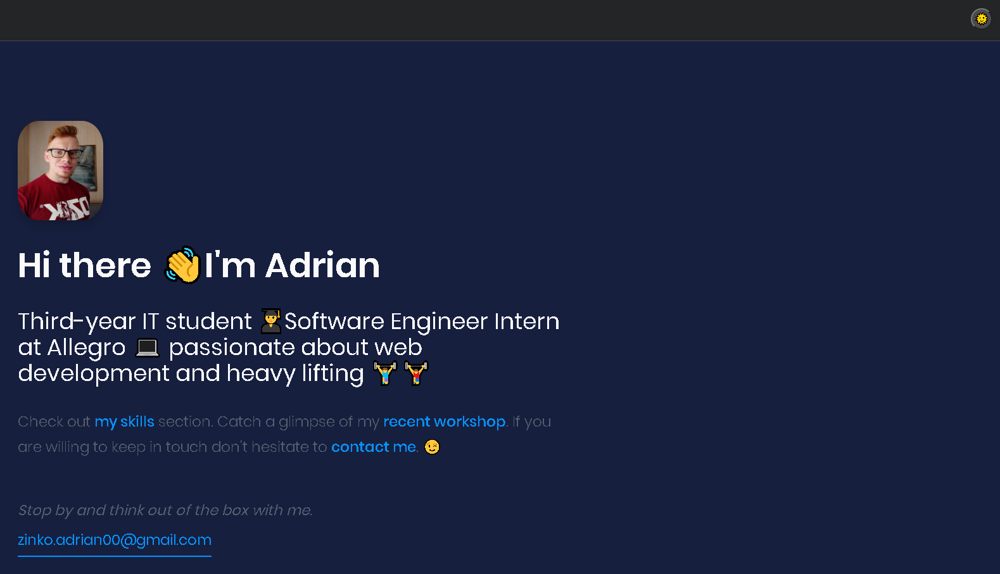

# adrianghub - Developer Portfolio in Gatsby :octocat:

## Getting Started :fire:

Take a look at my website: [Adrian Zinko Personal Portfolio](https://adrianghub.netlify.app) 

Share your thoughts ✨ I would appreciate your unique feedback 🙌 *__zinko.adrian00@gmail.com__*

## :gem: Technologies :gem:

- HTML5
- CSS3 / Sass
- JavaScript / React.js
- Gatsby

To open locally use `gatsby develop`

## Author :octocat:

* **_Adrian Zinko_** - [AdrianGHub](https://github.com/adrianghub/dev-portfolio) :link:
